# 🍳 SmartRecipe: AI-Powered Recipe Generator

<div align="center">
  
  
  [](https://djangoproject.com/)
  [](https://python.org/)
  [](https://ai.google/)
  [](https://getbootstrap.com/)
</div>

---

## 🌟 Overview

**SmartRecipe** is an innovative web application that transforms your available ingredients into delicious and creative recipes using the power of **Google's Gemini AI**. Say goodbye to food waste and hello to endless culinary inspiration!

### ✨ Key Highlights
- 🤖 **AI-Powered**: Leverage Google's Gemini AI for intelligent recipe generation
- 🔐 **Secure Authentication**: User registration and login system
- 📱 **Responsive Design**: Works seamlessly on desktop and mobile
- 📚 **Recipe History**: Keep track of all your generated recipes
- ⚡ **Real-time Generation**: Dynamic content with smooth AJAX experience

---

## 📋 Table of Contents

- [Features](#-features)
- [How It Works](#-how-it-works)
- [Screenshots](#-screenshots)
- [Technologies Used](#-technologies-used)
- [Installation](#-installation)
- [Usage](#-usage)
- [Project Structure](#-project-structure)
- [Contributing](#-contributing)
- [License](#-license)
- [Contact](#-contact)

---

## 🚀 Features

### Core Functionality
- **🔐 User Authentication**: Secure user registration and login system
- **🤖 AI Recipe Generation**: Enter ingredients and get complete recipes with:
  - Recipe title and description
  - Detailed ingredient list
  - Step-by-step cooking instructions
  - Nutritional information
- **📖 Recipe History**: Access all previously generated recipes
- **📱 Responsive Design**: Modern UI that adapts to all screen sizes
- **⚡ Dynamic Content**: Real-time recipe generation using AJAX

### Technical Features
- **🔒 Secure**: Built with Django's security features
- **🎨 Modern UI**: Clean and intuitive interface
- **🌐 Cross-platform**: Works on all modern browsers
- **💾 Data Persistence**: SQLite database for reliable data storage

---

## 🔄 How It Works

```mermaid
graph TD
    A[👤 Sign Up/Login] --> B[📝 Enter Ingredients]
    B --> C[🤖 AI Processing]
    C --> D[🍳 Recipe Generated]
    D --> E[💾 Save to History]
    E --> F[👁️ View & Cook]
```



1. **Sign Up/Login**: Create an account or log in to get started
2. **Enter Ingredients**: Input available ingredients on the generation page
3. **AI Magic**: Gemini AI creates a unique recipe based on your ingredients
4. **Instant Results**: View your personalized recipe immediately
5. **Save & Access**: All recipes are automatically saved to your history

---

## 📸 Screenshots

### 🏠 Homepage


> The welcoming landing page showcasing SmartRecipe's features and benefits

### 📝 User Registration


> Clean and simple user registration interface

### 🔐 Login Page


> Secure user authentication portal

### 🍳 Recipe Generator


> The heart of SmartRecipe - where ingredients become delicious recipes

### 🍳 Recipe Generator Result


> The Result of SmartRecipe - where SmartRecipe become delicious recipes


### 📚 Recipe History


> Your personal collection of AI-generated culinary creations

---

## 🛠 Technologies Used

### Backend Technologies
| Technology | Purpose |
|------------|---------|
|  | Core programming language |
|  | Web framework |
|  | AI recipe generation |

### Frontend Technologies
| Technology | Purpose |
|------------|---------|
|  | Structure and markup |
|  | Styling and layout |
|  | Interactive functionality |
|  | AJAX and DOM manipulation |
|  | Responsive design |

### Database
| Technology | Purpose |
|------------|---------|
|  | Data storage |

---

## ⚙️ Installation

### Prerequisites
- Python 3.8 or higher
- pip package manager
- Google Gemini API key

### Step-by-Step Setup

1. **Clone the repository**
   ```bash
   git clone https://github.com/Rahulsaini27/SmartRecipe-AI-Powered-Recipe-Generator.git
   cd smartrecipe
   ```

2. **Create and activate virtual environment**
   
   **Windows:**
   ```bash
   python -m venv venv
   venv\Scripts\activate
   ```
   
   **macOS/Linux:**
   ```bash
   python3 -m venv venv
   source venv/bin/activate
   ```

3. **Install dependencies**
   ```bash
   pip install -r requirements.txt
   ```
   
   **Required packages (`requirements.txt`):**
   ```text
   Django>=4.0
   google-generativeai
   python-dotenv
   nltk
   ```

4. **Configure environment variables**
   
   Create a `.env` file in the root directory:
   ```env
   GEMINI_API_KEY=your_gemini_api_key_here
   SECRET_KEY=your_django_secret_key
   DEBUG=True
   ```

5. **Set up the database**
   ```bash
   python manage.py migrate
   ```

6. **Create admin user (optional)**
   ```bash
   python manage.py createsuperuser
   ```

7. **Run the development server**
   ```bash
   python manage.py runserver
   ```

8. **Access the application**
   
   Open your browser and navigate to: `http://127.0.0.1:8000/`

---

## 📖 Usage

### Getting Started
1. **Register**: Create a new account on the sign-up page
2. **Login**: Access your account with your credentials
3. **Generate Recipe**: 
   - Navigate to the "Generate Recipe" page
   - Enter your available ingredients (comma-separated)
   - Click "Generate Recipe" and watch the AI work its magic!
4. **View History**: Check your "Recipe History" to see all past creations
5. **Cook & Enjoy**: Follow the generated instructions and enjoy your meal!

### Example Ingredients Input
```
chicken breast, rice, bell peppers, onions, garlic, soy sauce
```

### Sample Output
The AI will generate a complete recipe including:
- **Recipe Title**: e.g., "Asian-Style Chicken and Vegetable Stir-Fry"
- **Ingredients List**: Detailed measurements and preparation notes
- **Instructions**: Step-by-step cooking process
- **Nutritional Info**: Basic nutritional information
- **Cooking Tips**: Additional suggestions for best results

---


## 🤝 Contributing

We welcome contributions from the community! Here's how you can help:

### How to Contribute

1. **🍴 Fork the repository**
   ```bash
   git fork https://github.com/Rahulsaini27/SmartRecipe-AI-Powered-Recipe-Generator.git
   ```

2. **🌿 Create a feature branch**
   ```bash
   git checkout -b feature/amazing-new-feature
   ```

3. **✨ Make your changes**
   - Add new features
   - Fix bugs
   - Improve documentation
   - Enhance UI/UX

4. **✅ Test your changes**
   ```bash
   python manage.py test
   ```

5. **💬 Commit your changes**
   ```bash
   git commit -m "Add amazing new feature"
   ```

6. **🚀 Push to your branch**
   ```bash
   git push origin feature/amazing-new-feature
   ```

7. **📬 Open a Pull Request**

### Areas for Contribution
- 🐛 Bug fixes
- ✨ New features
- 📚 Documentation improvements
- 🎨 UI/UX enhancements
- 🧪 Testing
- 🌐 Localization

---

## 📜 License

This project is licensed under the **MIT License**. See the [LICENSE](LICENSE) file for more details.

```
MIT License

Copyright (c) 2024 SmartRecipe

Permission is hereby granted, free of charge, to any person obtaining a copy
of this software and associated documentation files (the "Software"), to deal
in the Software without restriction, including without limitation the rights
to use, copy, modify, merge, publish, distribute, sublicense, and/or sell
copies of the Software, and to permit persons to whom the Software is
furnished to do so, subject to the following conditions:

The above copyright notice and this permission notice shall be included in all
copies or substantial portions of the Software.
```

---

## 📞 Contact

<div align="center">

### 👨‍💻 Developer Information

**Your Name**  
📧 **Email**: rahulsaini42854@gmail.com  
🐙 **GitHub**: [Rahulsaini27](https://github.com/Rahulsaini27/SmartRecipe-AI-Powered-Recipe-Generator)  
💼 **LinkedIn**: [Rahul LinkedIn Profile](https://www.linkedin.com/in/rahul-saini-3994a2241/)  

---

### 💬 Get in Touch

Have questions, suggestions, or just want to say hi? We'd love to hear from you!

[](mailto:your-email@example.com)
[](https://github.com/your-github-username)
[](https://linkedin.com/in/your-profile)

</div>

---

<div align="center">

### 🌟 Show Your Support

If you found this project helpful, please give it a ⭐ on GitHub!

**Made with ❤️ by [Your Name]**

*Happy Cooking! 🍳✨*

</div>